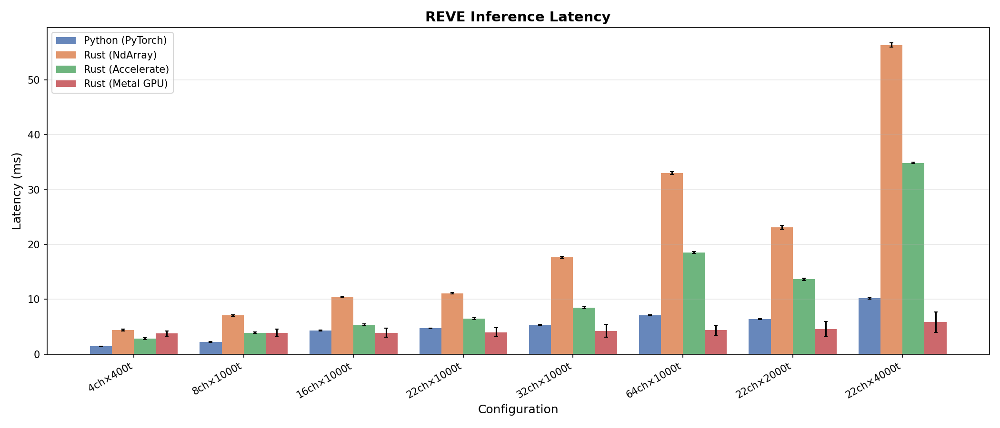
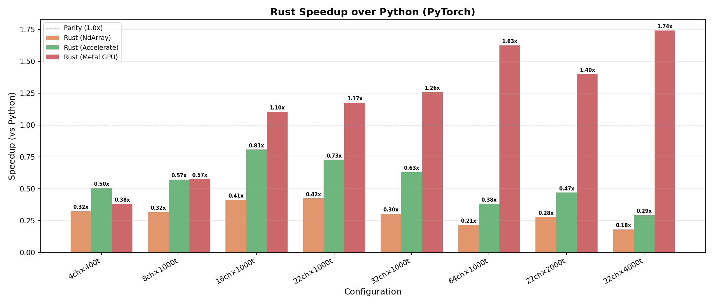
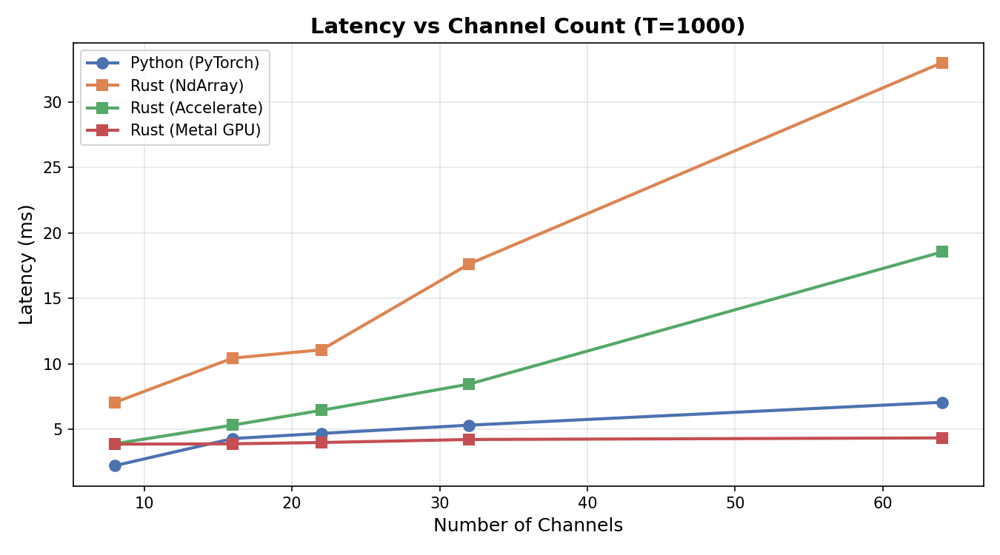
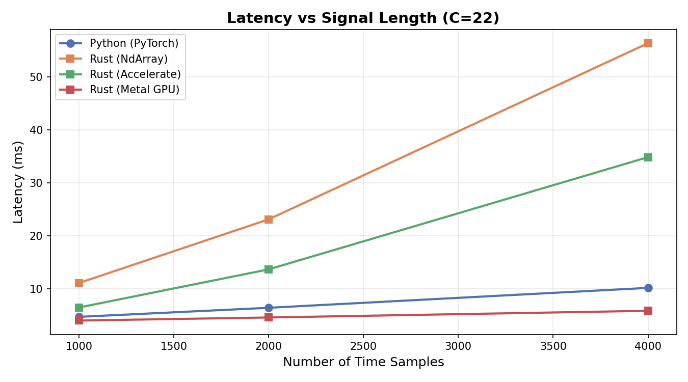
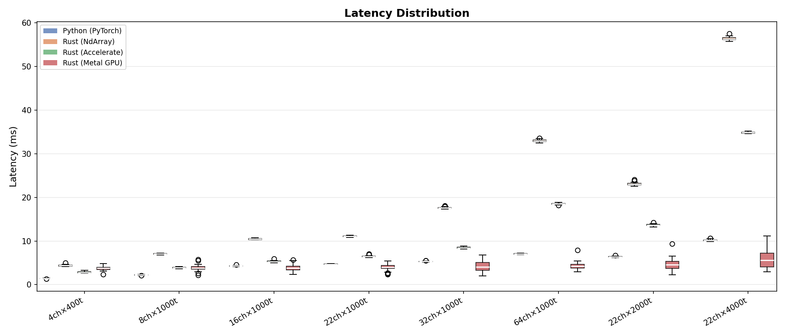

# reve-rs

Pure-Rust inference for the **REVE** (Representation for EEG with Versatile Embeddings) foundation model, built on [Burn 0.20](https://burn.dev).

REVE is pretrained on **60,000+ hours** of EEG data from **92 datasets** spanning **25,000 subjects**. Its key innovation is a **4D Fourier positional encoding** scheme that enables generalization across arbitrary electrode configurations without retraining.

## Architecture

```
EEG [B, C, T]
    │
    ├─ Overlapping Patch Extraction (unfold)
    │  → [B, C, n_patches, patch_size]
    │
    ├─ Linear Patch Embedding
    │  → [B, C*n_patches, embed_dim]
    │
    ├─ 4D Positional Encoding (Fourier + MLP)
    │  (x, y, z, t) → [B, C*n_patches, embed_dim]
    │
    ├─ Transformer Encoder (RMSNorm, GEGLU, Multi-Head Attention)
    │  → [B, C*n_patches, embed_dim]
    │
    └─ Classification Head (Flatten+LN+Linear or Attention Pooling)
       → [B, n_outputs]
```

## Quick Start

```rust
use reve_rs::{ReveEncoder, data};
use std::path::Path;

// Load model
let (model, ms) = ReveEncoder::<B>::load(
    Path::new("config.json"),
    Path::new("model.safetensors"),
    device,
)?;

// Build input batch
let batch = data::build_batch::<B>(
    signal,     // [C, T] flat f32
    positions,  // [C, 3] flat f32
    n_channels,
    n_samples,
    &device,
);

// Run inference
let output = model.run_batch(&batch)?;
println!("Output: {:?}", output.shape);
```

## Benchmarks

Benchmarked on Apple M3 Max (arm64, macOS 26.3.1) with `embed_dim=512`, `depth=2`, `heads=8`.
Python baseline: PyTorch 2.8.0 (with Accelerate BLAS). Rust backends: NdArray (Rayon), NdArray + Apple Accelerate BLAS, and Metal GPU (wgpu).

### Inference Latency



### Speedup vs Python



The **Metal GPU** backend achieves up to **1.74x speedup** over PyTorch on large inputs (22ch × 4000 samples), with near-constant latency regardless of input size thanks to GPU parallelism.

### Channel Scaling



Metal GPU latency stays nearly flat (~4 ms) as channels increase from 8 to 64, while CPU backends scale linearly.

### Time Scaling



### Latency Distribution



### Summary Table

| Configuration | Python (PyTorch) | Rust (NdArray) | Rust (Accelerate) | Rust (Metal GPU) |
|---------------|:----------------:|:--------------:|:-----------------:|:----------------:|
| 4ch × 400t    | 1.42 ms          | 4.39 ms        | 2.82 ms           | 3.74 ms          |
| 8ch × 1000t   | 2.22 ms          | 7.05 ms        | 3.90 ms           | 3.87 ms          |
| 16ch × 1000t  | 4.30 ms          | 10.44 ms       | 5.33 ms           | 3.90 ms          |
| 22ch × 1000t  | 4.69 ms          | 11.07 ms       | 6.45 ms           | **4.00 ms** 🏆   |
| 32ch × 1000t  | 5.32 ms          | 17.63 ms       | 8.46 ms           | **4.23 ms** 🏆   |
| 64ch × 1000t  | 7.07 ms          | 33.00 ms       | 18.54 ms          | **4.35 ms** 🏆   |
| 22ch × 2000t  | 6.40 ms          | 23.09 ms       | 13.65 ms          | **4.57 ms** 🏆   |
| 22ch × 4000t  | 10.16 ms         | 56.36 ms       | 34.84 ms          | **5.84 ms** 🏆   |

> **Note:** PyTorch benefits from highly optimized MKL/Accelerate BLAS + custom CUDA/MPS kernels. The Rust CPU backends use generic implementations. Metal GPU achieves the best absolute performance for ≥16 channels.

### Numerical Parity

Python ↔ Rust output difference: **< 6×10⁻⁷** (f32 precision limit). Verified with shared weights and identical inputs.

## Build

```bash
# CPU (default — NdArray + Rayon)
cargo build --release

# CPU with Apple Accelerate BLAS (macOS)
cargo build --release --features blas-accelerate

# GPU (Metal on macOS)
cargo build --release --no-default-features --features metal

# GPU (Vulkan on Linux/Windows)
cargo build --release --no-default-features --features vulkan
```

## CLI Inference

```bash
# Download weights (requires HuggingFace access)
cargo run --release --features hf-download --bin download_weights -- --repo brain-bzh/reve-base

# Run inference
cargo run --release --bin infer -- --weights data/model.safetensors --config data/config.json -v
```

## Run Benchmarks

```bash
# Build all backends
cargo build --release --example benchmark
cargo build --release --example benchmark --features blas-accelerate
cargo build --release --example benchmark --no-default-features --features metal

# Copy binaries
cp target/release/examples/benchmark target/release/examples/benchmark_ndarray
# (rebuild with features and copy as benchmark_accelerate, benchmark_metal)

# Run full benchmark suite
python3 bench.py
```

## Pretrained Weights

Weights are on [HuggingFace](https://huggingface.co/collections/brain-bzh/reve):

| Model | Params | Embed Dim | Layers |
|-------|--------|-----------|--------|
| `brain-bzh/reve-base` | 72M | 512 | 22 |
| `brain-bzh/reve-large` | ~400M | 1250 | — |

> **Note:** You must agree to the data usage terms on HuggingFace before downloading.

## Features

| Feature | Description |
|---------|-------------|
| `ndarray` (default) | CPU backend with Rayon multi-threading |
| `blas-accelerate` | Apple Accelerate BLAS (macOS) |
| `openblas-system` | System OpenBLAS (Linux) |
| `wgpu` | GPU via wgpu (auto-detect Metal/Vulkan/DX12) |
| `metal` | Native Metal shaders (macOS) |
| `vulkan` | Native Vulkan shaders (Linux/Windows) |
| `hf-download` | HuggingFace Hub weight download |

## Citation

If you use this crate in your research, please cite both the REVE paper and this implementation:

```bibtex
@inproceedings{elouahidi2025reve,
    title     = {{REVE}: A Foundation Model for {EEG} -- Adapting to Any Setup with Large-Scale Pretraining on 25,000 Subjects},
    author    = {El Ouahidi, Yassine and Lys, Jonathan and Th{\"o}lke, Philipp and Farrugia, Nicolas and Pasdeloup, Bastien and Gripon, Vincent and Jerbi, Karim and Lioi, Giulia},
    booktitle = {The Thirty-Ninth Annual Conference on Neural Information Processing Systems},
    year      = {2025},
    url       = {https://openreview.net/forum?id=ZeFMtRBy4Z}
}

@software{hauptmann2025reverustinference,
    title     = {reve-rs: {REVE} {EEG} Foundation Model Inference in Rust},
    author    = {Hauptmann, Eugene},
    year      = {2025},
    url       = {https://github.com/eugenehp/reve-rs},
    version   = {0.0.1},
    note      = {Rust/Burn implementation with Metal GPU acceleration}
}
```

## Author

[Eugene Hauptmann](https://github.com/eugenehp)

## References

- El Ouahidi et al. (2025). *REVE: A Foundation Model for EEG — Adapting to Any Setup with Large-Scale Pretraining on 25,000 Subjects.* NeurIPS 2025.
- [braindecode Python implementation](https://github.com/braindecode/braindecode)

## License

Apache-2.0
